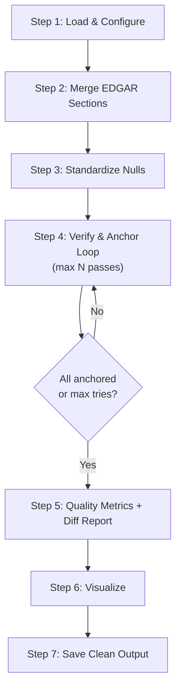

# Cleanup Pipeline Diagnosis & Revised Proposal

## Executive Summary

The three notebooks (`clean_up.ipynb`, `analysis_and_clean_up.ipynb`, `analysis_and_clean_up_v2.ipynb`) represent three evolutionary stages of the same pipeline. The result is significant code duplication, inconsistent approaches, and bolted-on features. Below is the full diagnosis, your feedback incorporated, and a revised pipeline.

---

## 1. Code Smells (Original 8 + New Findings)

### Smell 1: Duplicated Functions Across Notebooks

`build_full_context`, `get_fingerprint`, HuggingFace streaming logic, and `find_best_source_sentence` are copy-pasted across notebooks with **subtle, undocumented variations** (e.g., `"".join` vs `"\n".join` in `build_full_context`).

### Smell 2: Abandoned Score-Based Verification

V1's `calculate_verification_score` was designed as a `0.0–1.0` score but **hardcodes `return 0.0`** for the fuzzy branch. It was abandoned mid-implementation. V2 switched to a clean boolean approach. The score concept is dead code.

### Smell 3: Three Different Data-Loading Patterns

The HuggingFace streaming → merge logic is implemented three different ways. Should be done exactly once.

### Smell 4: Double-Loop Processing

V2 iterates all found rows once for anchoring, then **again** for section identification. Should be a single pass.

### Smell 5: External Validation Bolted On

Section 6 in V2 re-loads a different CSV, re-builds `full_text`, and defines a **near-duplicate** `find_section_for_sentence_val` function. This should be integrated into the main pipeline as a retry/validation loop.

### Smell 6: Magic Strings Scattered Everywhere

The sentinel-value list (`["NOT_FOUND", "NULL", "NONE", ...]`) appears **6+ times** with slightly different subsets. No single source of truth.

### Smell 7: Pandas `FutureWarning` — Incompatible Dtype

Section columns initialized as `np.nan` (float64) then assigned string values like `"section_1"`. Will **break** in future pandas.

### Smell 8: Fragile Column Drops

V1 manually lists 30+ column names. V2's suffix-based approach is better — we'll use that pattern.

### Smell 9 (New): `full_text` as a Matching Surface Is Fragile

Concatenating all sections into one giant string and searching it is problematic:

- The join character (`""` vs `"\n"`) silently affects exact matching
- A sentence that appears in `section_1` and `section_7` can't be distinguished
- It's **slower** than searching individual sections because you're scanning ~100k chars instead of ~10k

> **Your feedback confirms**: check individual sections instead of `full_text`. This is cleaner and gives us section identification **for free** during verification.

### Smell 10 (New): No Diff/Analysis Logging

When evidence doesn't match, or when source_sentence changes during anchoring, there's **no record of what changed or why**. Using `difflib` to generate a report would make debugging and iterating much easier.

### Smell 11 (New): No Retry Loop for Anchoring

The pipeline does one pass of anchoring. If source sentences are manually edited (adding/removing whitespace, `\n` issues), they need re-validation and re-anchoring. This should be a **fixed-iteration loop** (e.g., max 3 passes: anchor → validate → re-anchor).

---

## 2. Revised Pipeline

Incorporating all your feedback, here is the new design:

### Step 1: Load & Configure

- Load ground truth CSV
- Define constants:
  - `SECTION_KEYS` — the 20 section column names
  - `NULL_SENTINELS` = `["NOT_FOUND", "NULL", "NONE", "NAN", ""]` — These are the string values in the CSV that **mean "no data."** The LLM writes these literal strings instead of leaving the cell empty. We centralize them so every null-check uses the same list.
  - `ERROR_SENTINELS` = `["JSON_PARSE_ERROR", "PARSE_ERROR", "NO_CONTENT", "NO_TEXT"]` — These mean "the extraction itself failed." Separate from nulls because they indicate a broken row, not a legitimate negative.
- **Derive field IDs from the DataFrame** by scanning for columns matching `*_value` and stripping the suffix. No hardcoded `FIELD_IDS` list. (IRS Tax ID columns get dropped before this step.)

### Step 2: Merge EDGAR Sections

- Stream HuggingFace dataset, match by `filename`
- Add missing `section_*` columns
- **One implementation, one time**

### Step 3: Standardize Nulls

- Replace all `NULL_SENTINELS` and `ERROR_SENTINELS` with `np.nan` across `_value`, `_evidence`, `_source_sentence` columns
- For rows where `_value` is NaN, also set `_source_sentence` and `_evidence` to NaN
- Ensure every field has a `_source_sentence` column (create as `pd.Series(dtype="object")` if missing)
- **Drop all IRS Tax ID columns** here, before further processing

### Step 4: Verify & Anchor (Iterative Loop)

This is the core of the pipeline, designed as a **reusable, modular loop**.

For **each field**, for **each row where value is not NaN**:

1. **Verify evidence** — search each `section_*` column individually (not `full_text`):
   - Exact substring match → verified, record which section
   - Fingerprint match (strip non-alphanumeric, lowercase) → verified, record section
   - Neither → not verified, log the mismatch details via `difflib`
2. **Anchor source sentence** — using the evidence and the section it was found in:
   - Exact match + short evidence (<25 chars) → find containing sentence
   - Exact match + long evidence → use evidence as source sentence
   - No exact match → fuzzy match via Levenshtein against sentences in matched section
   - Store result in `_source_sentence` (or `np.nan` if failed)
3. **Record section** — `_section` = whichever `section_*` column the sentence was found in (comes free from step 1)

**Retry logic**: Run this loop up to N times (e.g., 3). After each pass, check how many rows still have `_value` but no `_source_sentence`. If the count didn't decrease, stop early. This handles the case where manual edits introduced whitespace/newline issues that the first pass missed but a re-anchor with relaxed matching catches.

### Step 5: Quality Metrics + Diff Report

- Compute per-field stats: verified %, unique/total source sentences, value-found-but-source-missing counts
- Use `difflib` to generate a **log file** for every evidence snippet that:
  - Failed to verify
  - Had its source_sentence changed during anchoring
  - Had mismatches between evidence and the closest match in the section
- Save this log as a separate `.txt` or `.md` file alongside the output CSV

### Step 6: Visualize

- Stacked bar chart: Verified Found / Unverified Found / Valid Negative / Error
- Keep it simple

### Step 7: Save Clean Output

- Programmatically build output columns: metadata (`filename`, `cik`, `year`) + sections + `{field}_value` + `{field}_source_sentence` + `{field}_section` per field
- Drop: `_evidence`, `_verified`, `full_text` (if it was ever created as intermediate)
- Use V2's suffix-based drop pattern
- Save with timestamp

---

## 3. Notebook Naming & Old File Cleanup

### New Notebook Name

I'd recommend: **`ground_truth_cleanup.ipynb`**

This is clear, matches the project's terminology (`data/ground_truth/` → `data/clean_ground_truth/`), and doesn't have a version number that will go stale.

### Can We Delete the Old Notebooks?

> [!CAUTION]
> Before deleting, confirm you don't need any saved cell outputs (charts, specific numbers) from V2 for your paper/research.

| Notebook                                                                                                                                 | Recommendation                                                                                                                                                             |
| ---------------------------------------------------------------------------------------------------------------------------------------- | -------------------------------------------------------------------------------------------------------------------------------------------------------------------------- |
| [clean_up.ipynb](file:///c:/Users/dersu/Code%20Stuff/EDGAR-Haystack/notebooks/extraction/clean_up.ipynb)                                 | **Delete** — fully superseded by V1 and V2. No unique logic.                                                                                                               |
| [analysis_and_clean_up.ipynb](file:///c:/Users/dersu/Code%20Stuff/EDGAR-Haystack/notebooks/extraction/analysis_and_clean_up.ipynb)       | **Delete** — V2 contains everything V1 does plus more. The unimplemented "Needle Sentences" markdown spec at the bottom was implemented in V2's Section 6.                 |
| [analysis_and_clean_up_v2.ipynb](file:///c:/Users/dersu/Code%20Stuff/EDGAR-Haystack/notebooks/extraction/analysis_and_clean_up_v2.ipynb) | **Archive to `docs/reference/`** — keep as a reference since it has executed outputs, then delete from `notebooks/extraction/` after the new notebook is verified working. |

So the plan would be:

1. Move `analysis_and_clean_up_v2.ipynb` → `docs/reference/archived_cleanup/`
2. Delete `clean_up.ipynb` and `analysis_and_clean_up.ipynb`
3. Create new `notebooks/extraction/ground_truth_cleanup.ipynb`

---

## 4. Key Design Decisions Locked In

Based on your feedback:

| Decision                      | Answer                                                         |
| ----------------------------- | -------------------------------------------------------------- |
| IRS Tax ID                    | **Drop entirely**                                              |
| Evidence verification surface | **Individual sections** (not `full_text`)                      |
| Join strategy for full_text   | **May not need `full_text` at all** — search sections directly |
| External validation           | **Integrated as retry loop** in main pipeline                  |
| Output columns                | `_value` + `_source_sentence` + `_section` only                |
| Save `full_text`?             | **No**                                                         |
| Column drop approach          | **V2's suffix-based pattern**                                  |
| Empty source sentences        | **Keep as `np.nan`** (always create the column)                |
| Field ID discovery            | **Derive from DataFrame columns** (scan for `*_value`)         |
| Diff logging                  | **Yes, via `difflib`** — save report file                      |
| Fingerprint matching          | **Needs improvement** — revisit implementation                 |
